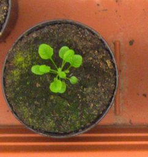

# Semantic Instance Segmentation with a Discriminative Loss Function

This repository implements [Semantic Instance Segmentation with a Discriminative Loss Function](https://arxiv.org/abs/1708.02551). However, it contains some enhancements.

* Reference paper does not predict foreground-background mask and it uses ground-truth mask. Instead, this code predicts foreground-background mask, similar to [ Towards End-to-End Lane Detection: an Instance Segmentation Approach](https://arxiv.org/abs/1802.05591).
* Reference paper predicts number of instances implicity. It predicts embeddings for instances and predicts number of instances as a result of clustering. Instead, this code predicts number of instances as an output of network.
* This code uses [Spectral Clustering](http://scikit-learn.org/stable/modules/generated/sklearn.cluster.SpectralClustering.html); however, reference paper uses "a fast variant of the mean-shift algorithm". 
* Reference paper uses a segmentation network based on [ResNet-38](https://arxiv.org/abs/1512.03385). Instead, this code uses [ReSeg](https://arxiv.org/abs/1511.07053)  with skip-connections based on first seven convolutional layers of [VGG16](https://arxiv.org/abs/1409.1556)  as segmentation network.

----------------------------

In prediction phase, network inputs an image and outputs a foreground-background mask, number of instances and embeddings for all pixels in the image. Then, foreground embeddings are selected using foreground-background mask and foreground embeddings are clustered into "number of instances" groups using spectral clustering.

# Installation

* Clone this repository : 

`git clone --recursive https://github.com/Wizaron/instance-segmentation-pytorch.git`

* Download and install [Anaconda](https://www.anaconda.com/download/) or [Miniconda](https://conda.io/miniconda.html)
* Create a conda environment : 

`conda env create -f instance-segmentation-pytorch/code/pytorch/conda_environment.yml`

## Data

* Download [CVPPP dataset](https://www.plant-phenotyping.org/datasets-download) and extract downloaded zip file to `instance-segmentation-pytorch/data/raw/`
*  This work uses *A1* subset of the dataset. 

## Code Structure

* **code**: Codes for training and evaluation.
	* **lib**
		* **lib/arch.py**: Defines network architecture.
		* **lib/model.py**: Defines model (optimization, criterion, fit, predict, test, etc.).
		* **lib/dataset.py**: Data loading, augmentation, minibatching procedures.
		* **lib/preprocess.py**, **lib/utils**: Augmentation methods.
		* **lib/prediction.py**: Prediction module.
		* **lib/losses/dice.py**: Dice loss for foreground semantic segmentation.
		* **lib/losses/discriminative.py**: [Discriminative loss](https://arxiv.org/pdf/1708.02551.pdf) for instance segmentation.
	* **settings**
		* **settings/data_settings.py**: Defines settings about data.
		* **settings/model_settings.py**: Defines settings about model (hyper-parameters). 
		* **settings/training_settings.py**: Defines settings for training (optimization method, weight decay, augmentation, etc.).
    * **train.py**: Training script.
	* **pred.py**, **pred.sh**: Prediction script.
	* **evaluate.py**: Evaluation script. Calculates SBD (symmetric best dice), |DiC| (absolute difference in count) and FBD (foreground-background dice) as defined in the [paper](http://eprints.nottingham.ac.uk/34197/1/MVAP-D-15-00134_Revised_manuscript.pdf).
* **data**:  Stores data and scripts to prepare dataset for training and evaluation.
	* **metadata**: Stores metadata; such as, training, validation and test splits, image shapes etc.
	* **processed**: Stores processed form of the data.
	* **raw**: Stores raw form of the data.
	* **scripts**: Stores scripts to prepare dataset.
		* **scripts/1-create_annotation.py**: Saves annotations as a numpy array to `processed/annotations/`.
		* **scripts/1-remove_alpha.sh**: Removes alpha channels from images. (In order to run this script, `imagemagick` should be installed.).
		* **scripts/2-get_image_means-stds.py**: Calculates and prints channel-wise means and standard deviations from training subset.
		* **scripts/2-get_image_shapes.py**:  Saves image shapes to `metadata/image_shapes.txt`.
		* **scripts/2-get_number_of_instances.py**: Saves number of instances in each image to `metadata/number_of_instances.txt`.
		* **scripts/3-create_dataset.py**: Creates an lmdb dataset to `processed/lmdb/`.
* **models**: Stores checkpoints of the trained models.
* **outputs**: Stores predictions of the trained models.

## Data Preparation

Data should be prepared prior to training and evaluation.

* Activate previously created conda environment :

`source activate ins-seg-pytorch`

* Place the extracted dataset to ``instance-segmentation-pytorch/data/raw``.  Hence, raw dataset should be found at `instance-segmentation-pytorch/data/raw/CVPPP2017_LSC_training`
* In order to prepare the data go to ``instance-segmentation-pytorch/data/scripts`` and 
	* ``python 1-create_annotations.py``
	* ``python 1-remove_alpha.sh``
	* ``python 3-create_dataset.py``

## Visdom Server

Start a [Visdom](https://github.com/facebookresearch/visdom) server in a ``screen`` or ``tmux``.

* Activate previously created conda environment :

`source activate ins-seg-pytorch`

* Start visdom server :

``python -m visdom.server``

* Access visdom server using `http://localhost:8097`

## Training

* Activate previously created conda environment :

`source activate ins-seg-pytorch`

* Go to `instance-segmentation-pytorch/code/` and run `train.py`
	* Arguments:
		* `--model [model_path]`: previously trained model path. (optional)
		* `--usegpu`: to use gpu.
		* `--nepochs [number_of_epochs]`: Number of epochs.
		* `--batchsize [batch_size]`: Minibatch size.
		* `--debug`: debug mode. (plots embeddings to visdom, it reduces size of embeddings to two-dimensions using TSNE. Hence, it slows down training.)
		* `--nworkers [n_workers]`: Number of workers that are used in data loading.

As training continues, models will be saved to ``instance-segmentation-pytorch/models/``.

## Evaluation

After training is complete, we can make predictions.

* Activate previously created conda environment :

`source activate ins-seg-pytorch`

* Go to `instance-segmentation-pytorch/code/` and run `./pred.sh [model_path]`. It will save predictions to ``instance-segmentation-pytorch/outputs/``.

For example:

``./pred.sh ../models/2018-2-24_16-1_jcmaxwell_6-459906/model_155_0.125209495425.pth``

* After prediction is complete run `python evaluate.py --pred_dir [prediction_directory]`. It will print metrics to the stdout.

For example:

`python evaluate.py --pred_dir ../outputs/2018-2-25_15-21_jcmaxwell_41-782743-model_257_0.124301478267`

## Outputs

### Scores on validation set (28 images)

| SBD           | \|DiC\|       | Foreground Dice  |
|:-------------:|:-------------:|:----------------:|
| 87.4          | 0.6           | 96.8             |

### Predictions

  
  
  
